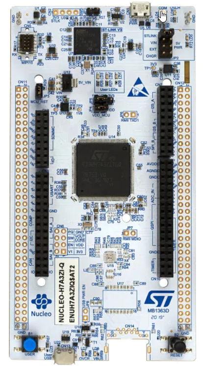

# Mastering STM32CubeMX 5 and CubeIDE - Embedded Systems
Use STM32 CubeMX and STM32 Cube IDE to code drivers and firmware 

## Summary
Source code adapted after the Udemy.com course "Mastering STM32CubeMX 5 and CubeIDE - Embedded Systems" , authored by Israel Gbati.

https://www.udemy.com/course/stm32cubemx-5-and-cubeide/

The source code is tested on STM32 Nucleo 144 family boards.
* https://www.st.com/en/evaluation-tools/nucleo-f429zi.html  and/or
* https://www.st.com/en/evaluation-tools/nucleo-h7a3zi-q.html 

Verify the STM32 CubeMx .pdf report file in each folder for the development board the exercise driver is referring to.

### STM32 Nucleo F429ZI

### STM32 Nucleo H7A3ZI-Q

## Repository info
The content within this repository is my own work produced as a result of completing the course.
### About me
* George Calin
* george.calin [at] gmail.com
* LinkedIn: https://www.linkedin.com/in/cgeorge1978/
